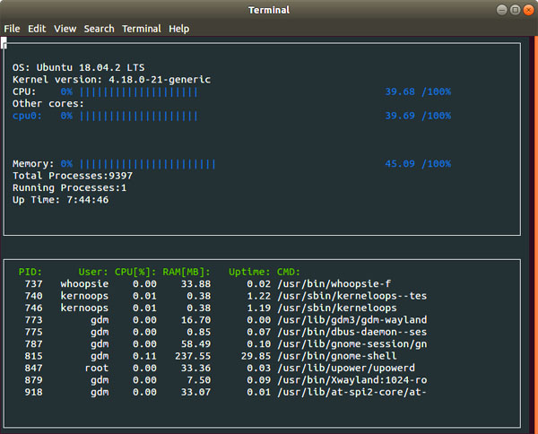

# Linux System Monitor

## Overview

I created Linux System Monitor. It monitors system status and display it on a terminal. The information is updated at every second.



- System Information
 - OS information
 - Kernel version
 - CPU usage(%)
 - each CPU core usage(%)
 - Memory Usage(%)
 - Total Processes
 - Running Processes
 - System Up Time (HH:MM:SS)

- Process information
 - PID (process id)
 - User (user name)
 - CPU usage (%)
 - RAM usage (Mbyte)
 - Process Up Time (seconds)
 - CMD (command line)

In the process information section, up to 10 processes are shown at one time and then another 10 processes come next second, and so on. In this way the system monitor continuously displays its information updated.

## Where all information comes from?
#### System Information
- **OS information**
 - file:`/etc/os-release`, line:`"PRETTY NAME="`

- **Kernel Version**
 - file:`/proc/version`, line:`"Linux version"`

- **CPU usage**
 - file:`/proc/stat`, line:`cpu`
 - format:`cpu [1] [2] [3] [4] [5] [6] [7] [8] [9] [10]`
 - field: `[1]`:USER, `[2]`:NICE, `[3]`:SYSTEM, `[4]`:IDLE, `[5]`:IOWAIT, `[6]`:IRQ, `[7]`:SOFTIRQ, `[8]`:STEAL, `[9]`:GUEST, `[10]`:GUEST_NICE
 - (1+2+3+6+7+8+9+10) = ACTIVE, (4+5) = IDLE
 - CPU% = `ACTIVE/(ACTIVE+IDLE)*100`  for the specific period

- **CPU core usage**
 - file:`/proc/stat`, line:`cpu` + `[core number]` (e.g. `cpu0`)
 - (calculation is the same as CPU usage)

- **Memory Usage**
 - file:`/proc/meminfo`
 - `MemAvailable: xxx kB`
 - `MemFree: xxx kB`
 - `Buffers: xxx kB`
 - Memory usage(%) = `MemFree / (MemAvailable - Buffers) * 100`

- **Total processes**
 - file:`/proc/stat`, line:`processes [number of processes]`

- **Running processes**
 - file:`/proc/stat`, line:`procs_running [number of processes]`

- **System Up Time**
 - file:`/proc/uptime`, the first token of the line (seconds)

#### Process information
- **PID**
 - get the pid list from `/proc/` directory. `/proc/` contains directories each of which has a dir name of its pid.

- **User**
 - get User ID of the process. file:`/proc/[pid]/status`, line:`Uid [ID]`.
 - get User Name corresponding to the Uid from file:`/etc/passwd`, line:`[user name]:[?]:[Uid]:...`

- **CPU usage**
 - file:`/proc/[pid]/stat`, which contains only one line.
 - The line contains 44 tokens (`[0]` - `[43]`):
   - `[13]`= CPU time spent in user code (in clock ticks)
   - `[14]`= CPU time spent in kernel code (in clock ticks)
   - `[15]`= CPU time spent in user code, including time from children(in clock ticks)
   - `[16]`= CPU time spent in kernel code, including time from children(in clock ticks)
   - `[21]`= Time when the process started (in clock ticks)
  - cpu total time = (`[13]+[14]+[15]+[16]`) in second
  - process run time = *System Up Time* - ([21] in second)
  - cpu usage(%) = (cpu totak time)/(process run time) * 100

- RAM usage (Mbyte)
 - file:`/proc/[PID]/status`, line:`VmData: xxxx kB`
 - get `xxxx` in Mbyte

- Process Up Time (seconds)
  - file:`/proc/[pid]/stat`, token`[13]` converted to second

- CMD
  - file:/proc/[pid]/cmdline. It has only one line that describes just a command.


## Repository
My task was to implement `ProcessParser.h` and `Process.h`. Also I modified some bits in other files.

 - `ProcessParser.h`: `ProcessParser` class. This class provides methods to get information about processes and the Linux system described above.
 - `Process.h`: `Process` class. This class acquires and holds the information about a process and provides setter and getter methods.
 - `ProcessContainer.h`: `ProcessContainer` class. This class holds the list of `Process` classes that represents processes in the system.
 - `SysInfo.h`: `SysInfo` class. This manages the system information.
 - `constants.h`: `Path` class. This provides wrapper methods for file paths.
 - `utils.h`: `Util` class. this class provides utility methods.
 - `main.cpp`: This file includes `main()`. It instantiates `ProcessContainer` and `SysInfo`, and print all the information on the terminal using **ncurses** library.
 - `try.cpp`: A driver program I made for the unit test on `ProcessParser.h`.
 - `images/`

## To compile and execute this program

On your Linux terminal,

1. Clone this repository:
```
git clone https://github.com/ChiekoN/CppND-System-Monitor
```

2. Install `ncurses` package (if your environment does not have that):
```
sudo apt-get install libncurses5-dev libncursesw5-dev
```
3. In the repository, compile and run:
```
g++ -std="c++17" main.cpp -lncurses
./a.out
```

## LICENSE
This project is a part of [Udacity C++ Nanodegree](https://www.udacity.com/course/c-plus-plus-nanodegree--nd213) program. See [LICENSE](LICENSE).
